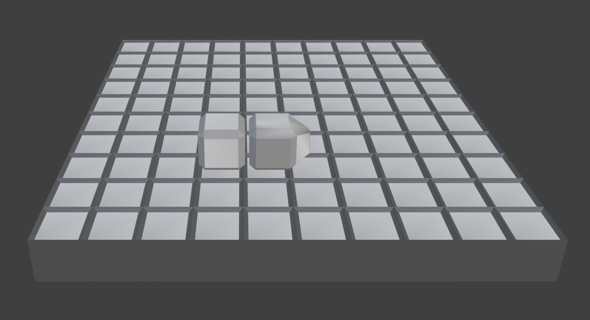

Snake 99

Author: Lucas Hurley

Design: This is a multiplayer version of snake, where the player must eat apples while dodging other players' snakes and also barrriers in the environment. As a slight twist I also added a jump for a bit more of a movement option.

Networking: (TODO: How does your game implement client/server multiplayer? What messages are transmitted? Where in the code?)

Screen Shot:

How To Play:

Use WASD to control the snake, space to jump.

This game was built with [NEST](NEST.md).

